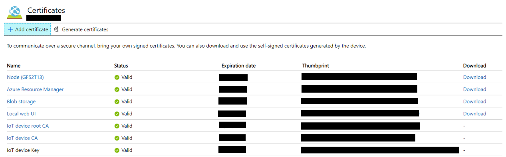
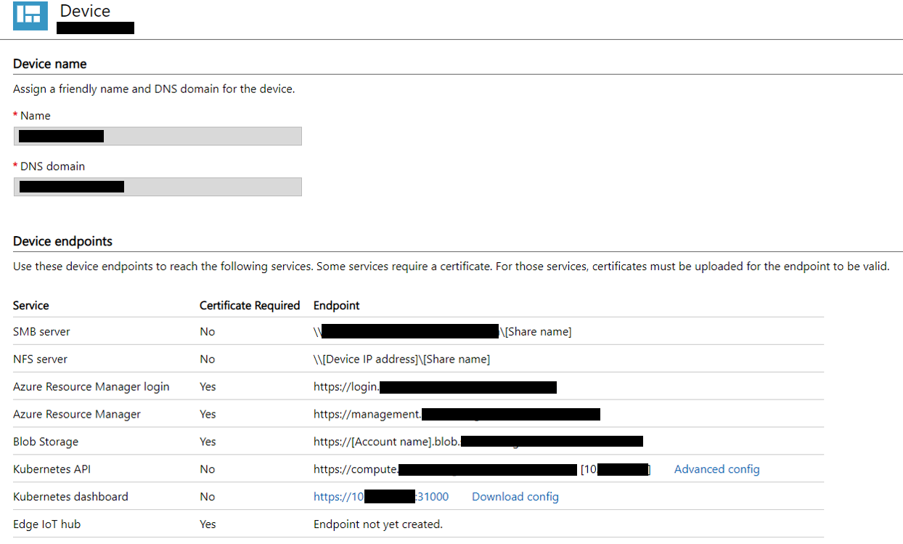

# Azure Stack Edge

## Connect ASE

1. Configure ASE host name

    To connect with DNS name you need to update `hosts` file located in `c:\windows\system32\drivers\etc` for connect ASE. For example,

    ```
    10.10.10.5 myedge.azurestackedge.com
    10.10.10.5 login.myedge.azurestackedge.com
    10.10.10.5 management.myedge.azurestackedge.com
    10.10.10.200 compute.myedge.azurestackedge.com
    10.10.10.5 myblob.blob.myedge.azurestackedge.com
    ```

2. Install certificates to your PC

    For https connection, ASE generated certs must be trusted and these certs should installed in the trusted root. 
    
    Browse to Azure Stack Edge portal (e.g., 10.10.10.5).
    
    Move to the certificates menu and download all the certificates.

    Install downloaded certificates (*.cer) to "Trusted Root Certificate Authorities".

    

3. Get endpoint information

    You many need to access some of workload in ASE, such as kubernetes cluster.
    
    Move to the device menu and get device endpoint information.

    You can download kubernetes `config` file and get endpoint of kubernetes dashboard.

    

## Connect ASE through Powershell

https://docs.microsoft.com/en-us/azure/databox-online/azure-stack-edge-connect-powershell-interface


## Connect managed Kubernetes cluster

https://docs.microsoft.com/en-us/azure/databox-online/azure-stack-edge-gpu-create-kubernetes-cluster

Add new user and assign to new namespace.

```
New-HcsKubernetesNamespace -Namespace test
# copy output and save as `config` in your PC.
New-HcsKubernetesUser -UserName testuser
Grant-HcsKubernetesNamespaceAccess -Namespace test -UserName testuser
```