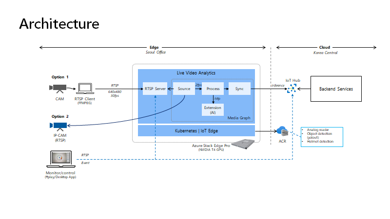

# RTSP for LVA



You have several options to setup RTSP source to LVA. Here are the recommended two options.

- Option 1: Use USB Camera + PC to send RTSP streaming to RTSP server.
- Option 2: Get RTSP streaming directly from IP Camera (or similar) which is running as RTSP server.

## Option 1

> assuming RTSP server is located in _10.10.10.10:8554_.

- RTSP Server:
    Download [rtsp simple server](https://github.com/aler9/rtsp-simple-server), config and start rtsp server.
    This server supports both Windows and Linux. You can run this server either near client of on the ASE (inside IoT Edge).

- RTSP streaming to server:
    Download [ffmpeg](https://ffmpeg.org/download.html) and stream video to rtsp server.

    Get camera device name (Windows)
    ```
    ffmpeg -f dshow -list_devices true -i dummy
    ```

    Sending 640x480 size camera streaming with h.264 format in Windows environment.
    ```
    ffmpeg -f dshow -i video="<camera name>" -vcodec libx264 -s 640x480 -f rtsp -rtsp_transport tcp rtsp://10.10.10.10:8554/cam1
    ```

    Sending a video file instead of camera.
    ```
    ffmpeg -re -stream_loop -1 -i "c:\filepath\video.mp4" -vcodec libx264 -vf scale=640:480 -f rtsp -rtsp_transport tcp rtsp://10.10.10.10:8554/cam1
    ```

- Play RTSP streaming

    Play with nobuffer to reduce latency.
    ```
    ffplay -fflags nobuffer rtsp://10.10.10.10:8554/visual
    ```

### USB Video Camera (or webcam)

If you don't have a USB camera then you can use your mobile phone as a webcam. There are many mobile software that provide webcam capability. I have tested iriun webcam, https://iriun.com/.

## Option 2

You can use mobile app for testing and this is a lot simpler than option 1.

Install [Live Reporter app](https://apps.apple.com/us/app/live-reporter-live-camera/id996017825). This app can send video stream to RTSP server but also runs as RTSP server.


## Other Options

- Use RSTP Simulator

    https://github.com/Azure/live-video-analytics/tree/master/utilities/rtspsim-live555

