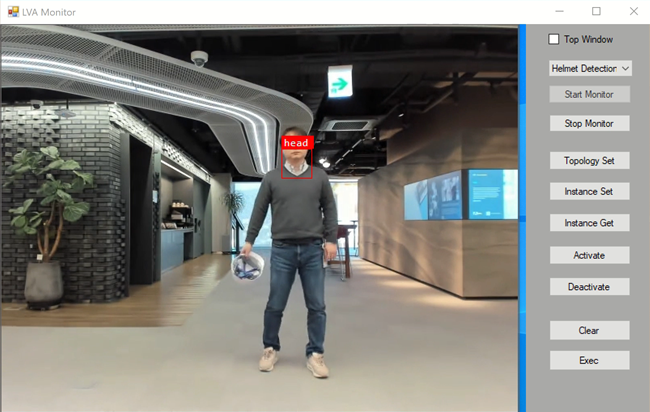

# development readme

> You must configure necessary settings in `appsettings.json` before run. 

This desktop app (.NET 5.0) is for monitoring LVA output from IoT Hub(eventhub).

Features:
- Config media graph
	- set topology (httpextension)
    - set/get instance
	- activate/deactivate instance
- Monitor and visualize LVA output
	- visualize various reading/detection output
    - note: this app does _not play_ RTSP streaming video, you have to launch RTSP client like, _FFplay_ and place this app on top of the stream video.



In development, you can set/refer secret settings like `IoThubConnectionString` in the [app secrets](https://docs.microsoft.com/en-us/aspnet/core/security/app-secrets).

## user secrets

This app use user secrets in _DEBUG mode_, you can store secrets, such as `IoThubConnectionString`, safely using user-secrets command.

To enable and set a secret,
```
dotnet user-secrets init
dotnet user-secrets set IoThubConnectionString "HostName=lva...."
```

## build

```
dotnet build
```

## publish as single file deployment

> https://docs.microsoft.com/en-us/dotnet/core/deploying/single-file

```
dotnet publish -c Release -o out
```

## samples/references

### IOT

IoT sample: https://github.com/Azure-Samples/azure-iot-samples-csharp/blob/master/iot-hub/Quickstarts/

Event Hub: https://github.com/Azure/azure-sdk-for-net/blob/master/sdk/eventhub/Azure.Messaging.EventHubs/samples/Sample05_ReadingEvents.md

IoT C2D sample: https://github.com/Azure-Samples/live-video-analytics-iot-edge-csharp/tree/master/src/cloud-to-device-console-app


### Dotnet

Console output: http://www.csharp411.com/console-output-from-winforms-application/

Thread(Task): https://docs.microsoft.com/en-us/dotnet/standard/parallel-programming/task-cancellation

json serialize/deserialize: https://docs.microsoft.com/en-us/dotnet/standard/serialization/system-text-json-how-to?pivots=dotnet-5-0

## Others

- dotnet issue: https://github.com/dotnet/sdk/issues/14916
    => fix: remove `C:\Program Files (x86)\dotnet` path in env

- user secrets for .net app:  https://medium.com/@granthair5/how-to-add-and-use-user-secrets-to-a-net-core-console-app-a0f169a8713f


