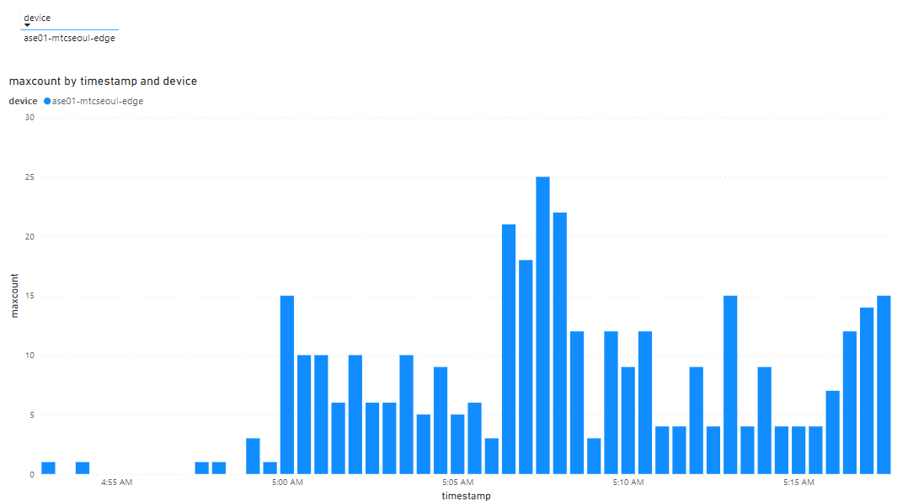

# ASA + PowerBI

This sample describes how to integrate LVA with backend application (PowerBI).

> This sample assumes you have successfully deployed LVA with AI extension (e.g., yolov3 object detection).

## ASA Setup

Configure ASA and PowerBI as described in this [documentation](https://docs.microsoft.com/en-us/azure/iot-hub/iot-hub-live-data-visualization-in-power-bi)

Use following ASA Query for counting maximum object detection in every 30 seconds windows.

```
WITH TMP AS (SELECT
    timestamp,
    lva.IotHub.ConnectionDeviceId as device,
    GetArrayLength(inferences) as objectcount
FROM
    powerbiinput lva
)

SELECT
    System.Timestamp() AS timestamp,
    device,
    max(objectcount) AS maxcount
INTO
    powerbioutput
FROM TMP
GROUP BY TumblingWindow(s, 30), objectcount, device
```

Save and run ASA.

## PowerBI

Create a report by adding report from the PowerBI workspace/datasets as below.



## Reference

IoT Hub scenario:
- PowerBI: https://docs.microsoft.com/en-us/azure/iot-hub/iot-hub-live-data-visualization-in-power-bi
- WebApp: https://docs.microsoft.com/en-us/azure/iot-hub/iot-hub-live-data-visualization-in-web-apps

ASA:
- https://docs.microsoft.com/en-us/azure/stream-analytics/stream-analytics-stream-analytics-query-patterns
- https://docs.microsoft.com/en-us/azure/stream-analytics/stream-analytics-parsing-json
- https://docs.microsoft.com/en-us/azure/stream-analytics/stream-analytics-window-functions


