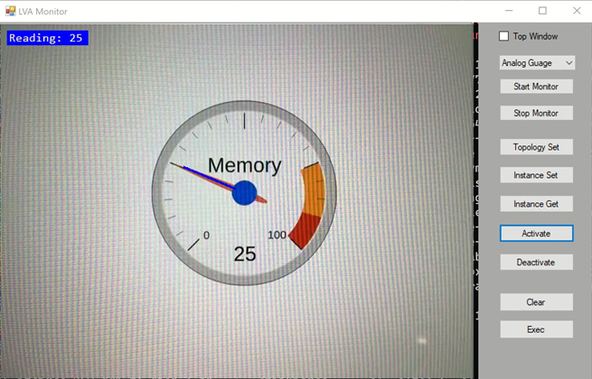

# README

This repo demonstrates how to build and setup Live Video Analytics service with Azure IoT, Azure LVA and Azure Stack.

## 1. [Edge](./1_Edge)

This section provides a guide for IoT Edge setup and sample [media graphs](https://docs.microsoft.com/en-us/azure/media-services/live-video-analytics-edge/media-graph-concept) for LVA.

RTSP source is one of important setup for LVA. This section also provides how to setup RTSP streaming to LVA edge using various tools.

## 2. [Extension](./2_Extension)

This section provides how to prepare AI-enabled extensions using one of well-known AI framework and object detector, [Darknet](https://pjreddie.com/darknet/).

This section also provides sample extensions for LVA.
- [analog gauge reader](./2_Extension/gauge)
- [pre-trained object detection](./2_Extension/yolov3-onnx-gpu)
- trained with custom dataset, [helmet(hardhat) detection](./2_Extension/darknetpy)

## 3. [Test](./3_Test)

Testing live video analytics with _IoT Edge_ is somewhat difficult. This section provides testing tools for LVA. 

- jupyter notebook for testing AI model with video.
- Windows desktop app for monitor/visualize _IoT Edge(LVA)_ output of above extensions.

